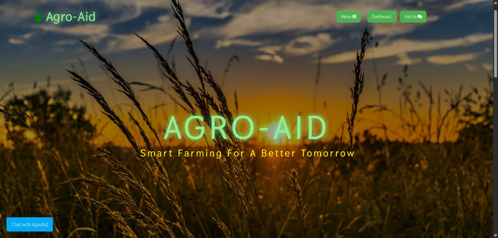
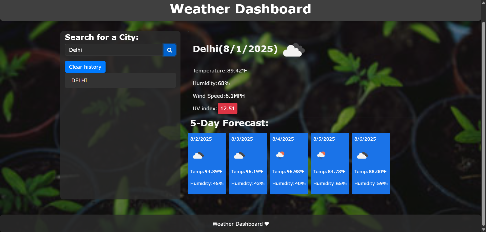
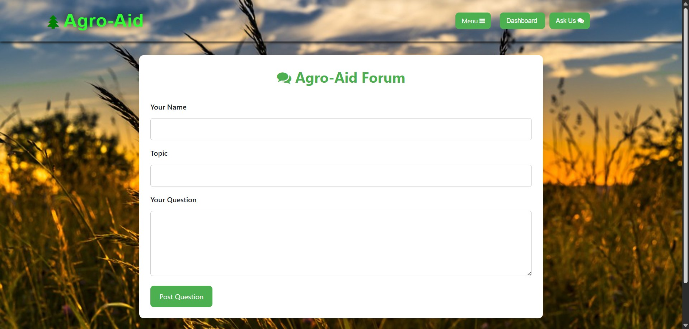
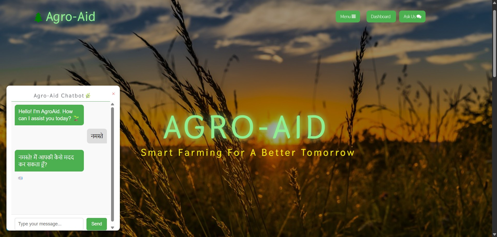

# Agro-Aid

Agro-Aid is a smart farming solution designed to assist farmers with crop recommendations, yield predictions, soil fertility analysis, and crop health assessments. The platform leverages machine learning models and real-time data to provide actionable insights for better agricultural outcomes.







## Features

### 1. Crop Recommendation
- Recommends the most suitable crops based on soil and environmental conditions.
- Utilizes a machine learning model trained on soil parameters like nitrogen, phosphorus, potassium, temperature, humidity, pH, and rainfall.
- Accessible via the [Crop Recommendation](pages/crop_recommendation.html) page.

### 2. Yield Prediction
- Predicts crop yield based on land area, production, state, crop type, district, and season.
- Uses a trained machine learning model for accurate forecasting.
- Available on the [Yield Prediction](pages/yield_prediction.html) page.

### 3. Soil Fertility Analysis
- Analyzes soil health to determine fertility levels.
- Provides recommendations for soil improvement.
- Found on the [Soil Fertility Analysis](pages/soil_fertility_analysis.html) page.

### 4. Crop Health Assessment
- Assesses the stress levels and health of crops.
- Helps in identifying potential issues early.
- Accessible through the [Crop Health Assessment](pages/stress_levels.html) page.

### 5. Weather Dashboard
- Displays current weather conditions and a 5-day forecast.
- Helps farmers plan their activities based on weather predictions.
- Available on the [Weather Dashboard](Weather-Dashboard/indexweather.html).

### 6. Ask Us Forum
- A community forum for users to ask questions and share knowledge.
- Accessible via the [Ask Us](Form/indexform.html) page.

## Chatbot
- An AI-powered chatbot for instant agricultural advice.
- Can be accessed directly from the homepage using the "Chat with AgroAid" button.


## Technologies Used
- **Frontend**: HTML, CSS, JavaScript
- **Backend**: Flask (Python)
- **Machine Learning**: Scikit-learn, Joblib
- **APIs**: Google Generative AI (Gemini), OpenWeatherMap
- **Data Handling**: Pandas, NumPy

## Setup Instructions
1. Clone the repository.
2. Install required Python packages:
   ```bash
   pip install flask flask-cors google-generativeai scikit-learn joblib pandas numpy

 🤝 Project Credits: 
* **Team:** This project was developed as a collaborative group effort.
* **My Contribution:** Frontend development , UI design 
* **Note:** This repository is a personal portfolio archive.
